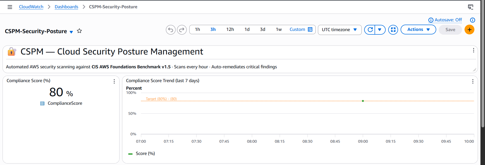
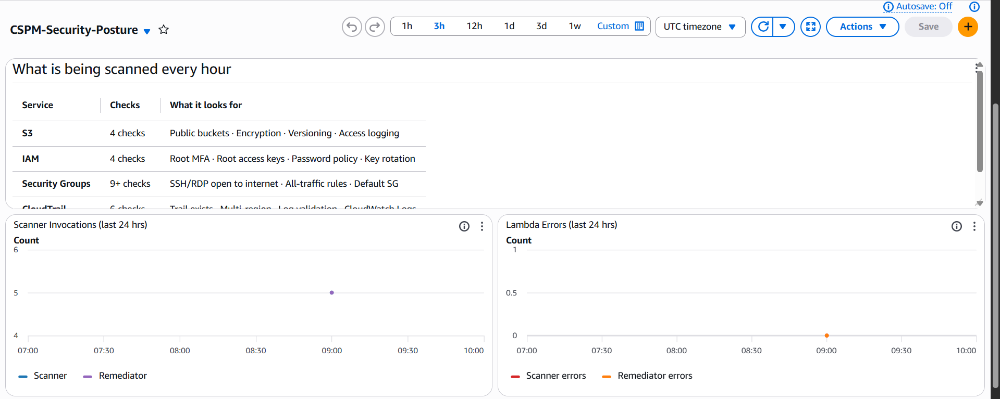

<div align="center">

# CSPM — Cloud Security Posture Management

**Automated AWS security scanning, alerting, and auto-remediation — serverless, event-driven, zero operational cost.**


</div>

---

## Table of Contents

- [The Problem](#the-problem)
- [Live Demo](#live-demo)
- [Architecture](#architecture)
- [Security Checks](#security-checks)
- [Auto-Remediation](#auto-remediation)
- [Compliance Score & Dashboard](#compliance-score--dashboard)
- [Tech Stack](#tech-stack)
- [Project Structure](#project-structure)
- [Deploy](#deploy)
  - [Running Tests](#running-tests)
  - [CI/CD via GitHub Actions](#cicd-via-github-actions)
- [Design Decisions](#design-decisions)
- [Known Limitations](#known-limitations)
- [AWS Free Tier](#aws-free-tier)
- [License](#license)
- [Author](#author)

---

## The Problem

Cloud misconfigurations are the **#1 cause of cloud data breaches** — not sophisticated attacks, just simple mistakes.

An S3 bucket accidentally left public. SSH open to the entire internet. A root account with no MFA. These are the findings that make headlines. CSPM catches them automatically, alerts you the moment they appear, and fixes the safe ones without human intervention.

Building this system surfaced a deeper problem: **security posture is not a point-in-time audit — it is a continuous formal verification problem.** The gap between a written security policy and a deployed system's actual state changes every time infrastructure mutates. Treating it as a snapshot (scan once, fix, done) is structurally wrong.

This project frames posture management as a state-transition system where remediation actions must preserve global security invariants — not just fix individual findings in isolation. That framing exposed an open question I could not answer purely through engineering: see [Known Limitations](#known-limitations).

---

## Live Demo

> First scan on a brand-new AWS account — detected and alerted within seconds.

```
CSPM scan started | region=us-east-1

Scan complete | total=25  passed=20  score=80.0%

[CRITICAL] IAM-001 — Root account does not have MFA enabled
[CRITICAL] CT-001  — No CloudTrail trail exists in this region
[CRITICAL] SG-22   — Security group allows unrestricted SSH access (port 22)

SNS alert sent              | critical_count=3
Remediator invoked asynchronously
Findings saved              | bucket=cspm-findings-<account-id> key=findings/2026-03-08T09-18-09Z.json
Metric published            | ComplianceScore=80.0
```

---

## Architecture

```
┌──────────────────────────────────────────────────────────────────┐
│                            AWS Cloud                             │
│                                                                  │
│          ┌──────────────────────┐                               │
│          │  EventBridge (hourly)│                               │
│          └──────────┬───────────┘                               │
│                     │                                            │
│                     ▼                                            │
│          ┌──────────────────────┐    ┌────────────────────────┐ │
│          │   Scanner Lambda     │───▶│ S3 · IAM · EC2 ·       │ │
│          │                      │    │      CloudTrail        │ │
│          └──────────┬───────────┘    └────────────────────────┘ │
│                     │                                            │
│       ┌─────────────┼────────────┬─────────────────────┐       │
│       ▼             ▼            ▼                     ▼       │
│   S3 findings   CloudWatch    SNS email          Remediator    │
│   (JSON report)   score        alerts              Lambda      │
│                                                      │          │
│                                         ┌────────────┴───────┐ │
│                                         ▼                    ▼ │
│                                   S3 public access      Open SG │
│                                      auto-fixed       rules removed│
└──────────────────────────────────────────────────────────────────┘
```

**Flow:** EventBridge triggers Scanner hourly → Scanner audits 4 AWS services → Findings saved to S3 → Compliance score pushed to CloudWatch → Critical findings trigger SNS email → Scanner asynchronously invokes Remediator → Remediator auto-fixes safe issues and logs the rest.

---

## Security Checks

### 23 checks mapped to CIS AWS Foundations Benchmark v1.5

| Service | Check ID | Finding | Severity | CIS Ref |
|---|---|---|---|---|
| S3 | S3-001 | Block Public Access not fully enabled | 🔴 Critical | 2.1.5 |
| S3 | S3-002 | Versioning disabled | 🟡 Low | 2.1.3 |
| S3 | S3-003 | Access logging disabled | 🟠 Medium | 2.1.1 |
| S3 | S3-004 | Default encryption disabled | 🟠 Medium | 2.1.1 |
| IAM | IAM-001 | Root account MFA disabled | 🔴 Critical | 1.5 |
| IAM | IAM-002 | Root account has active access keys | 🔴 Critical | 1.4 |
| IAM | IAM-003 | Password policy below CIS minimum | 🟠 Medium | 1.8–1.11 |
| IAM | IAM-004 | Access key older than 90 days | 🟠 Medium | 1.14 |
| EC2 / SG | SG-22 | SSH open to 0.0.0.0/0 or ::/0 | 🔴 Critical | 5.2 |
| EC2 / SG | SG-3389 | RDP open to 0.0.0.0/0 or ::/0 | 🔴 Critical | 5.3 |
| EC2 / SG | SG-3306 | MySQL exposed to internet | 🟥 High | 5.x |
| EC2 / SG | SG-5432 | PostgreSQL exposed to internet | 🟥 High | 5.x |
| EC2 / SG | SG-27017 | MongoDB exposed to internet | 🟥 High | 5.x |
| EC2 / SG | SG-6379 | Redis exposed to internet | 🟥 High | 5.x |
| EC2 / SG | SG-9200 | Elasticsearch exposed to internet | 🟥 High | 5.x |
| EC2 / SG | SG-ALL | All traffic allowed (protocol -1) | 🔴 Critical | 5.x |
| EC2 / SG | SG-DEFAULT | Default security group has inbound rules | 🟠 Medium | 5.4 |
| CloudTrail | CT-001 | No trail exists | 🔴 Critical | 3.1 |
| CloudTrail | CT-002 | Trail is not multi-region | 🟥 High | 3.1 |
| CloudTrail | CT-003 | Log file validation disabled | 🟠 Medium | 3.2 |
| CloudTrail | CT-004 | Not integrated with CloudWatch Logs | 🟠 Medium | 3.4 |
| CloudTrail | CT-005 | Log bucket is publicly accessible | 🔴 Critical | 3.3 |
| CloudTrail | CT-006 | Logging currently paused | 🔴 Critical | 3.1 |

> **Note on port-range awareness:** A rule allowing TCP `0–65535` still triggers the SSH check. Most tools match only exact port numbers — this one checks if the sensitive port falls within the rule's allowed range. IPv4 (`0.0.0.0/0`) and IPv6 (`::/0`) are both checked.

---

## Auto-Remediation

The Remediator Lambda auto-fixes issues that are safe to correct programmatically. Everything else is flagged for human review with explicit remediation instructions.

| Finding | Auto-Fix Applied |
|---|---|
| S3 public access enabled | Enables all 4 Block Public Access settings |
| S3 versioning disabled | Enables versioning on the bucket |
| SSH / RDP open to internet | Revokes the specific offending inbound rule |
| All-traffic SG rule | Removes the open-world inbound rule |
| IAM / CloudTrail issues | ⚠️ Logged for human review — too risky to auto-fix |

> **DRY_RUN mode (default: on)** — Logs every fix it *would* make without touching anything. Flip `DRY_RUN=false` in `terraform.tfvars` once you've reviewed your first findings.

Every remediation action is written as a timestamped JSON audit report to S3.

---

## Compliance Score & Dashboard

After each scan, a compliance score is computed and pushed to CloudWatch as a custom metric:

```
Score = (Passed Checks / Total Checks) × 100
```

A **CloudWatch Dashboard** is deployed automatically — showing compliance score, 7-day trend, Lambda invocations, and error rates in one view.





Score progression on this account (brand new → progressively secured):

```
Scan 1 — new account, no config:   66.7%  ████████████████████░░░░░░░░░░
Scan 2 — CloudTrail created:       68.0%  ████████████████████░░░░░░░░░░
Scan 3 — IAM + SG + CT fixed:     76.0%  ██████████████████████░░░░░░░░
Scan 4 — CloudWatch Logs linked:   80.0%  ████████████████████████░░░░░░
```

---

## Tech Stack

| Layer | Technology |
|---|---|
| Language | Python 3.11 |
| Compute | AWS Lambda (Scanner + Remediator) |
| Scheduling | AWS EventBridge (hourly cron) |
| Storage | AWS S3 (findings JSON + audit reports) |
| Alerting | AWS SNS (email on critical findings) |
| Monitoring | AWS CloudWatch (custom metrics + dashboard) |
| Security APIs | AWS IAM · EC2 · CloudTrail |
| IaC | Terraform |
| CI/CD | GitHub Actions |
| AWS SDK | boto3 |
| Testing | pytest (64 tests) · moto (AWS mocks) |
| Linting | ruff |

---

## Project Structure

```
cspm/
├── scanner/
│   ├── models.py                  # Finding dataclass (check_id, severity, status, remediation)
│   ├── scanner.py                 # Lambda handler — orchestrates all checks
│   └── checks/
│       ├── s3_checks.py           # 4 checks: public access, versioning, logging, encryption
│       ├── iam_checks.py          # 4 checks: root MFA, root keys, password policy, key age
│       ├── sg_checks.py           # 9 checks: SSH, RDP, DB ports, all-traffic, default SG
│       └── cloudtrail_checks.py   # 6 checks: trail exists, multi-region, validation, CW Logs
├── remediator/
│   ├── remediator.py              # Lambda handler + check_id dispatcher
│   └── actions/
│       ├── s3_actions.py          # block_public_access(), enable_versioning()
│       └── sg_actions.py          # revoke_open_inbound_rules(), revoke_all_traffic_rule()
├── infrastructure/
│   ├── main.tf                    # Provider + AWS account data source
│   ├── variables.tf               # aws_region, alert_email, dry_run, scan_schedule
│   ├── s3.tf                      # Findings bucket (encrypted, versioned, 90-day lifecycle)
│   ├── sns.tf                     # Alert topic + email subscription
│   ├── iam.tf                     # Least-privilege roles for scanner + remediator
│   ├── lambda.tf                  # Both Lambda functions + shared zip packaging
│   ├── eventbridge.tf             # Hourly schedule + Lambda invoke permission
│   ├── cloudwatch_dashboard.tf    # Live dashboard: score trend, invocations, errors
│   ├── outputs.tf                 # Bucket name, function names, manual invoke command
│   └── terraform.tfvars.example   # Safe template — copy to terraform.tfvars
├── tests/
│   ├── conftest.py                # Shared fixtures and mocks
│   ├── test_models.py             # Finding model unit tests
│   ├── test_s3_checks.py          # S3 checks (pass + fail cases)
│   ├── test_iam_checks.py         # IAM checks (pass + fail cases)
│   ├── test_sg_checks.py          # SG checks (pass + fail cases)
│   └── test_cloudtrail_checks.py  # CloudTrail checks (pass + fail cases)
├── demo/
│   ├── dashboard-score.png        # CloudWatch score widget screenshot
│   └── dashboard-full.png         # Full dashboard screenshot
├── .github/workflows/
│   └── pipeline.yml               # CI: lint + test on PR | CD: terraform deploy on main
└── requirements.txt
```

---

## Deploy

### Prerequisites

- AWS account (Free Tier is sufficient)
- [Terraform](https://developer.hashicorp.com/terraform/install) ≥ 1.5
- Python 3.11+
- AWS CLI configured (`aws configure`)

### One-time setup

```bash
# 1. Clone
git clone https://github.com/UTKARSH698/CSPM.git
cd CSPM/infrastructure

# 2. Configure variables
cp terraform.tfvars.example terraform.tfvars
# Edit terraform.tfvars — set alert_email and aws_region

# 3. Deploy (creates ~19 AWS resources)
terraform init
terraform apply

# 4. Confirm the SNS subscription email AWS sends you

# 5. Run your first scan
aws lambda invoke --function-name cspm-scanner --region us-east-1 result.json
cat result.json

# 6. View the live dashboard
# AWS Console → CloudWatch → Dashboards → CSPM-Security-Posture
```

### Running Tests

No AWS credentials needed — all 64 tests use `moto` to mock AWS APIs locally.

```bash
pip install pytest pytest-cov boto3 "moto[s3,iam,ec2,cloudtrail]"
pytest tests/ -v --cov=scanner --cov=remediator --cov-report=term-missing
```

### CI/CD via GitHub Actions

Every push to `main` automatically lints, tests, and deploys.

Add these 4 secrets under `Settings → Secrets → Actions`:

| Secret | Value |
|---|---|
| `AWS_ACCESS_KEY_ID` | IAM user access key |
| `AWS_SECRET_ACCESS_KEY` | IAM user secret key |
| `AWS_REGION` | `us-east-1` |
| `ALERT_EMAIL` | Email for security alerts |

---

## Design Decisions

**DRY_RUN by default**
The remediator ships safe. It logs every fix it would make without applying anything. Switch to `false` only after reviewing your first findings.

**Async remediation**
Scanner invokes the remediator with `InvocationType=Event` (fire-and-forget). Scanner latency stays under 6 seconds regardless of how many issues need fixing.

**IAM and CloudTrail not auto-fixed**
Automatically rotating access keys or modifying trail configurations risks breaking production workloads. These are flagged for human review with explicit remediation steps.

**IPv4 + IPv6 both checked**
Security group checks cover `0.0.0.0/0` (IPv4) and `::/0` (IPv6). Most similar tools miss IPv6 entirely.

**Port-range awareness**
A rule allowing TCP `0–65535` still triggers the SSH/RDP checks. Most tools match exact port numbers only — this one checks whether the sensitive port falls anywhere within the rule's allowed range.

**Least-privilege IAM**
Scanner role: read-only on S3, IAM, EC2, and CloudTrail. Remediator role: only the specific write actions it needs. Neither role has admin access.

**Single zip, two Lambdas**
Both Lambda functions share one deployment package. Different handler paths point to each entry point — simpler packaging, smaller attack surface.

---

## Known Limitations

These are honest accounts of what the system does not yet handle — documented design boundaries, not overlooked bugs.

| Limitation | Root Cause | What Would Be Needed |
|---|---|---|
| **Remediation completeness under concurrent misconfigurations** — applying fix A then fix B in dependency order is locally safe, but I cannot formally prove this strategy is complete under all possible concurrent misconfiguration states | The dependency-ordering heuristic was derived from engineering intuition, not from a formal model of remediation state space | A formal model of the cloud environment as a state-transition system, with proof that the dependency-ordering strategy preserves global security invariants in all reachable states — not just the cases I tested |
| **Single-region only** — checks run in the configured region; resources in other regions are invisible to the scanner | EventBridge schedule and Lambda execute in one region; no cross-region aggregation | Multi-region aggregator Lambda collecting findings across all enabled regions before scoring |
| **No drift detection between scans** — if a misconfiguration appears and is manually fixed within the same hourly window, CSPM never sees it | Point-in-time scanning; no continuous state comparison | EventBridge rule on CloudTrail API events for real-time drift detection between scheduled scans |
| **Remediation is not idempotent across Lambda retries** — if the remediator Lambda retries after a partial fix, it may attempt to re-apply an already-applied action | No idempotency key or state check before each action | Pre-remediation state check: read current resource state before writing, skip if already compliant |
| **No cross-account support** — scanner operates only within the account it is deployed in | IAM role is scoped to the deployment account | STS AssumeRole pattern with a central aggregator account and spoke roles in each target account |

### The Open Formal Question

The remediation safety problem — whether a sequence of individually correct fixes can produce a collectively insecure intermediate or final state — is the core unsolved question this project exposed.

My current strategy (dependency-ordered fixes, single control boundary per cycle) prevents the cases I could construct. But I cannot prove it handles all cases. Specifically: under *k* simultaneous misconfigurations with interdependent remediation actions, does dependency ordering always produce a safe final state? Is there a bound on *k* beyond which the strategy fails?

This is a formal methods question, not an engineering one. It motivates my interest in applying model checking and policy verification techniques to cloud infrastructure state.

---

## AWS Free Tier

| Service | How Used | Free Limit |
|---|---|---|
| Lambda | 2 invocations/hour (scanner + remediator) | 1M req/month |
| EventBridge | 1 scheduled event/hour | 1M events/month |
| S3 | ~10 KB JSON per scan | 5 GB storage |
| CloudWatch | 1 custom metric per scan | 10 custom metrics free |
| SNS | Email on critical findings only | 1M publishes/month |

**Estimated monthly cost: $0**

---

## License

MIT © [Utkarsh Batham](https://github.com/UTKARSH698)

---

## Author

**Utkarsh Batham** — B.Tech CSE · Cloud Technology & Information Security

[](https://github.com/UTKARSH698)
[](https://linkedin.com/in/utkarshbatham)
